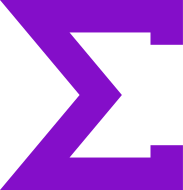

<h1 align="center">
   
</h1>
  

  <h1>DEVus - Articles about Development/h1>

  <a href="#about"> About </a> &nbsp;&nbsp;&nbsp;| &nbsp;&nbsp;&nbsp;
  <a href="#click-on-the-button-below-to-vist-the-blog">Deploy</a> &nbsp;&nbsp;&nbsp;|&nbsp;&nbsp;&nbsp;
  <a href="#features">Features</a> &nbsp;&nbsp;&nbsp;|&nbsp;&nbsp;&nbsp;
  <a href="#license">License</a>

  
    
  
  

## Click on the button below to check it out

# About

### Sigma - Best way to learn is by teaching what you know

In this blog I share things about Web and Mobile Development that i'm learning from bootcamps, courses and articles that I occasionally read or subject that i already know. That way I can learn better and maybe end up helping someone else.
<code>The articles are being written in English because I want to improve my English writing skills and I think that's a very good way to do so</code>. Sorry in advance in case you found some typos, that can happen very often.     
At the end of each article you can find all the sources I used to learn some specific topic and then make the article itself. For more information just check the link below the articles. :)

 

Developed with <code>NextJS</code>, <code>TailwindCSS</code>, <code>GraphQL</code>  and <code>GraphCMS</code>  
 

#### Features:
- [X] With featured and recent posts
- [X] categories
- [X] author information
- [X] comments and much more,
- [X] fully responsive CMS Blog App
- [X] Finally and one the best feature is that  
you and your clients can manage the blog from a dedicated Content Management System.  
 
## License

This project is licensed under the MIT License - see the [LICENSE](https://opensource.org/licenses/MIT) page for details.
